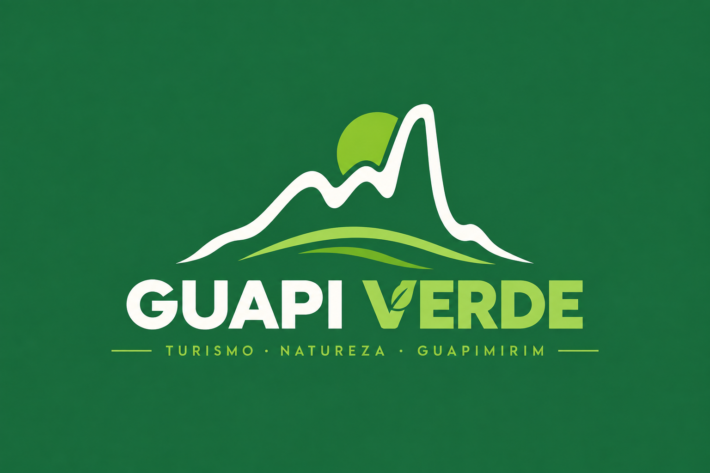

<p align="center">
  
</p>

<h1 align="center">Guapi Verde</h1>

<p align="center">
  Uma Progressive Web App mobile-first para divulgar atrativos naturais, turismo local, eventos e parcerias sustentáveis em Guapimirim/RJ.
</p>

<p align="center">
  
  
  
  
  
  
</p>

> **Demonstração visual:** a identidade principal está disponível acima. O repositório ainda não possui screenshots ou GIFs versionados; uma gravação curta do fluxo do produto pode ser acrescentada aqui pela equipe quando estiver disponível.

## Status do projeto

> **MVP acadêmico em desenvolvimento.** Há fluxos públicos, autenticação, perfil e manutenção de atrativos implementados. Agenda, Explorar e parte dos módulos administrativos ainda não possuem uma experiência completa no frontend, embora alguns já tenham endpoints no backend.

| Legenda | Significado |
| --- | --- |
| 🟢 | Implementado no código atual |
| 🟡 | Em desenvolvimento ou com cobertura parcial entre API e interface |
| ⚪ | Planejado no MVP ou evolução futura |

## Sobre o projeto

O Guapi Verde é um projeto acadêmico de **MVP Mobile** do curso de Análise e Desenvolvimento de Sistemas do UNIFESO. Trata-se de uma aplicação digital responsiva, priorizada para dispositivos móveis, que centraliza informações sobre parques, reservas e atrativos naturais de Guapimirim.

O problema abordado é a dispersão, a desatualização e a dificuldade de localizar informações sobre atrativos naturais e turismo local. Isso afeta o planejamento de visitantes, a visibilidade dos espaços e a divulgação de negócios locais. O MVP organiza esse conteúdo em uma aplicação com área pública, recursos para visitantes cadastrados e área restrita para administração.

## Objetivo

Simplificar o acesso a informações confiáveis sobre turismo em Guapimirim e permitir que responsáveis autorizados atualizem disponibilidade, horários, eventos, temporadas e novidades.

## Proposta de valor

O Guapi Verde conecta visitantes a atrativos naturais e empreendimentos locais. Visitantes podem planejar a visita e acessar benefícios; a administração mantém as informações atualizadas; empresas parceiras são divulgadas em campanhas e benefícios, sem receber dados pessoais identificáveis de visitantes.


## Funcionalidades do MVP

### 🟢 Implementadas

- Cadastro, login, logout e restauração de sessão com JWT (`RF01`–`RF03`).
- Consulta de categorias, destaques, detalhes de atrativos, imagens, horários e orientação por link de rota quando há coordenadas (`RF04`, `RF06`–`RF08`).
- Favoritos e preferências de categorias para visitantes autenticados (`RF09` e `RF10`).
- Consulta de parceiros e campanhas na área de benefícios (`RF11`).
- Painel administrativo protegido e gerenciamento de categorias, atrativos, imagens e horários (`RF12`–`RF15`).
- Exibição do próximo evento válido na página inicial (`RF16`).

### 🟡 Em desenvolvimento ou cobertura parcial

- Interface administrativa para eventos, temporadas, parceiros, campanhas, cupons e novidades (`RF20`–`RF25`). Os respectivos controladores REST existem no backend, porém não há telas administrativas correspondentes no frontend.
- Consulta e gestão de cupons na interface e registro de consentimentos (`RF24` e `RF26`): há recursos REST no backend, sem fluxo de frontend identificado.
- Métricas agregadas de visualizações, cliques, favoritos e interesses, previstas no escopo mínimo, não foram identificadas no código atual.

### ⚪ Escopo planejado do MVP

Os requisitos funcionais `RF01` a `RF26` e os requisitos não funcionais `RNF01` a `RNF17` compõem o escopo acadêmico do MVP. Os itens em desenvolvimento permanecem parte da entrega planejada e não são tratados como concluídos neste README.

## Requisitos do sistema

Os requisitos completos estão no [Documento de Requisitos em PDF](./Lista_RF_RNF.pdf). Em resumo:

| Grupo | Cobertura documentada |
| --- | --- |
| Experiência pública | `RF04`–`RF08`, `RF11`, `RF16`–`RF19`, `RF25` |
| Conta do visitante | `RF01`, `RF02`, `RF09`, `RF10`, `RF24`, `RF26` |
| Administração | `RF03`, `RF12`–`RF15`, `RF20`–`RF25` |
| Arquitetura e integração | `RNF01`–`RNF03`, `RNF10`, `RNF14`–`RNF17` |
| Segurança e privacidade | `RNF04`–`RNF09` |
| Experiência móvel | `RNF11`–`RNF13` |

## Escopo do MVP

A primeira entrega funcional inclui consulta de conteúdo turístico, conta de visitante, favoritos, interesses, benefícios de parceiros e administração de conteúdo. O fluxo essencial planejado é: explorar atrativos, consultar informações de visita, criar conta para salvar interesses e favoritos, visualizar benefícios e permitir que administradores atualizem o conteúdo.

### Fora do escopo / evoluções futuras

Os documentos acadêmicos registram como evoluções futuras:

- Rastreamento de trilhas e check-in por GPS.
- Missões ecológicas, pontos, ranking e conquistas.
- Avaliações, comentários e relatos públicos.
- Painel autônomo para empresas parceiras.
- Pagamento online e contratação automática de anúncios.
- Motor avançado de recomendação.
- Previsão do tempo, notificações push e funcionamento offline.
- Chat, compartilhamento social e denúncias ambientais.
- Venda ou entrega de dados pessoais identificáveis a terceiros.

O documento de requisitos também não identifica no escopo atual recuperação de senha, edição de perfil pelo usuário, exclusão da própria conta, resgate efetivo de cupom e notificações por push, e-mail ou SMS.

## Critérios de aceite

Conforme o escopo mínimo, a validação da entrega considera, entre outros pontos:

- Consulta de atrativos, horários, disponibilidade, eventos, temporadas e novidades.
- Cadastro, autenticação, logout, favoritos e visualização de benefício.
- Acesso administrativo restrito e atualização de conteúdos obrigatórios.
- Publicação refletida corretamente na área do visitante.
- Campanhas exibidas com métricas agregadas de cliques ou visualizações.
- Proteção de rotas administrativas e responsividade nos tamanhos definidos.
- Testes funcionais, de segurança básica, desempenho e usabilidade antes da apresentação.

## Tecnologias

| Camada | Tecnologias verificadas |
| --- | --- |
| Frontend | React 19, React Router, Axios, Vite, Tailwind CSS e Lucide React |
| Backend | Java 21, Spring Boot 4.1.0, Spring MVC, Spring Data JPA, Bean Validation e Lombok |
| Banco de dados | PostgreSQL e Hibernate/JPA |
| Segurança | Spring Security, JWT Bearer, BCrypt e CORS configurável |
| Infraestrutura | Docker, Docker Compose e imagem PostgreSQL 17 |
| PWA | `vite-plugin-pwa`, manifest e Service Worker |
| Documentação da API | OpenAPI/Swagger por `springdoc-openapi` 3.1.0 |

## Arquitetura

O repositório é um monorepo. O frontend React consome a API REST via Axios; o backend Spring Boot organiza controladores, serviços, DTOs, persistência JPA e mecanismos de segurança; os dados são persistidos no PostgreSQL.

```text
Usuário
   │
   ▼
PWA / Frontend React + Vite
   │ HTTP / JSON
   ▼
API REST / Spring Boot
   │ JPA / Hibernate
   ▼
PostgreSQL
```

## Estrutura do projeto

```text
guapi-verde-/
├── Backend/
│   ├── src/main/java/com/GuapiVerde/mvp/
│   │   ├── configuration/    # Segurança, OpenAPI e dados iniciais
│   │   ├── controller/       # Endpoints REST
│   │   ├── dto/              # Contratos de entrada e resposta
│   │   ├── entity/           # Entidades JPA
│   │   ├── repository/       # Persistência
│   │   ├── security/         # JWT e respostas de autorização
│   │   └── service/          # Regras de negócio
│   ├── src/main/resources/   # application.properties
│   ├── compose.yaml          # Backend e PostgreSQL
│   ├── Dockerfile
│   └── .env.example
├── Frontend/
│   ├── public/               # Ícone da aplicação
│   ├── src/
│   │   ├── app/              # Rotas
│   │   ├── componentes/      # Componentes compartilhados
│   │   ├── contextos/        # Autenticação
│   │   ├── funcionalidades/  # Telas e fluxos
│   │   └── servicos/         # Cliente e serviços da API
│   ├── package.json
│   ├── vite.config.js
│   └── .env.example
├── GuapiVerde_EscopoMinimo.pdf
├── Lista_RF_RNF.pdf
└── README.md
```

## Segurança

- Sessões stateless com JWT Bearer; o frontend envia o token nas requisições autenticadas.
- Spring Security restringe operações administrativas ao perfil `ADMIN`.
- Senhas são processadas por `BCryptPasswordEncoder` antes da persistência.
- DTOs utilizam validação e a API possui respostas padronizadas para erros de validação, autenticação, autorização, conflito e recurso inexistente.
- CORS aceita somente origens explícitas em `CORS_ORIGENS`; o uso de `*` é rejeitado pela configuração.
- A rota administrativa do frontend é protegida por `RotaAdmin`.

## PWA e experiência mobile

O Vite é configurado com `vite-plugin-pwa`, manifesto em `pt-BR`, modo `standalone`, ícone próprio e registro imediato do Service Worker com atualização automática. A interface utiliza layout responsivo, navegação inferior e componentes com semântica, rótulos e mensagens de estado em diversos fluxos.

## API

Com o backend em execução, a documentação interativa está em [`http://localhost:8080/swagger-ui.html`](http://localhost:8080/swagger-ui.html). O contrato OpenAPI JSON está em [`http://localhost:8080/v3/api-docs`](http://localhost:8080/v3/api-docs).

| Método | Endpoint | Finalidade |
| --- | --- | --- |
| `POST` | `/api/auth/cadastro` | Cadastro de visitante |
| `POST` | `/api/auth/login` | Autenticação e obtenção do token JWT |
| `GET` | `/api/atrativos` | Consulta pública de atrativos |
| `GET` | `/api/atrativos/{id}` | Detalhes de um atrativo |
| `GET` | `/api/eventos` | Consulta pública de eventos |
| `GET` | `/api/categorias-atrativos` | Consulta pública de categorias |

## Como executar

### Pré-requisitos

- Git
- Java 21
- Node.js e npm
- Docker Engine com Docker Compose para executar backend e banco em contêiner
- PostgreSQL para executar o backend fora do Docker

### Clonagem e configuração

```bash
git clone https://github.com/MarcosPagayme/guapi-verde-.git
cd guapi-verde-
```

Configure o frontend a partir do exemplo:

```bash
cd Frontend
cp .env.example .env
```

`VITE_API_URL` aponta para `http://localhost:8080` no arquivo de exemplo.

Configure o backend para o Docker Compose:

```bash
cd ../Backend
cp .env.example .env
```

Preencha valores locais seguros para `POSTGRES_PASSWORD`, `JWT_CHAVE`, `ADMIN_EMAIL` e `ADMIN_SENHA`. O arquivo `.env` não deve ser versionado.

### Backend e banco com Docker

Na pasta `Backend/`:

```bash
docker compose up --build
```

O Compose inicia PostgreSQL e backend, aguardando o health check do banco antes de iniciar a aplicação. Para interromper os serviços, use `docker compose down`; o volume `dados_guapi_verde` preserva os dados.

### Backend sem Docker

1. Inicie um PostgreSQL local e crie o banco `guapi_verde`.
2. Defina `SPRING_DATASOURCE_URL`, `SPRING_DATASOURCE_USERNAME` e `SPRING_DATASOURCE_PASSWORD`. Sem sobrescrita, a URL padrão é `jdbc:postgresql://localhost:5440/guapi_verde`.
3. Na pasta `Backend/`, execute:

```bash
./mvnw spring-boot:run
```

No Windows:

```powershell
.\mvnw.cmd spring-boot:run
```

### Frontend

Em outro terminal, na pasta `Frontend/`:

```bash
npm ci
npm run dev
```

### Acessos locais

| Serviço | Endereço padrão |
| --- | --- |
| Frontend Vite | `http://localhost:5173` |
| API | `http://localhost:8080` |
| Swagger UI | `http://localhost:8080/swagger-ui.html` |
| PostgreSQL exposto pelo Compose | `localhost:5440` |

## Dados de demonstração

Fora do perfil `prod`, `DataInitializr` é executado por padrão e cria dados de demonstração de forma idempotente. A carga atual contém 2 categorias, 2 atrativos, 2 eventos, 2 temporadas, 2 parceiros, 2 campanhas, 2 cupons, 2 novidades e contas de teste de visitante e administrador. As credenciais não são repetidas neste documento.

Para uma demonstração limpa, prefira um banco ou volume de dados dedicado. A remoção de volumes existentes apaga dados persistidos e deve ser feita somente de forma deliberada.


## Equipe

| Integrante | GitHub |
| --- | --- |
| [**Amanda Lisbôa Ramos**](https://github.com/AmandaLisboa-Ramos) | [@AmandaLisboa-Ramos](https://github.com/AmandaLisboa-Ramos) |
| [**Elizeu Costa**](https://github.com/ElizeuCossta) | [@ElizeuCossta](https://github.com/ElizeuCossta) |
| [**Marcos Pagayme**](https://github.com/MarcosPagayme) | [@MarcosPagayme](https://github.com/MarcosPagayme) |
| [**Bruna Ferreira**](https://github.com/Bruna3221) | [@Bruna3221](https://github.com/Bruna3221) |

### Orientação acadêmica

[**Professor Rodrigo Braga**](https://www.rodrigobragatere.com/)<br>
[Site oficial](https://www.rodrigobragatere.com/)

## Informações acadêmicas

| Campo | Informação |
| --- | --- |
| Instituição | UNIFESO |
| Curso | Análise e Desenvolvimento de Sistemas |
| Disciplina | MVP Mobile |
| Projeto | Guapi Verde |
| Professor | Rodrigo Braga |
| Período | Agosto de 2026 |


## Próximos passos

- Completar os fluxos administrativos e de visitante previstos em `RF20`–`RF26`.
- Implementar e validar métricas agregadas previstas pelo escopo.
- Executar verificações de testes, lint, build, segurança básica, desempenho e usabilidade antes da apresentação.
- Completar os dados mínimos de demonstração e adicionar protótipos ou capturas de tela ao repositório.

## Documentação do projeto

- [Escopo Mínimo do MVP](./Guapi_Verde_Escopo_Minimo_MVP.docx.pdf)
- [Documento de Requisitos de Software](./Lista_RF_RNF.pdf)
- [Documentação interativa da API](http://localhost:8080/swagger-ui.html) — disponível com o backend em execução.
